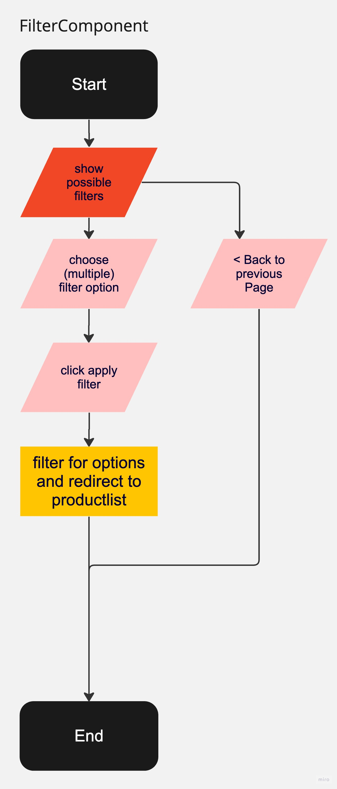
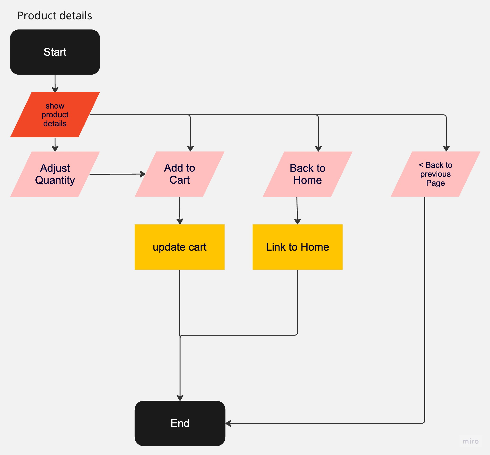
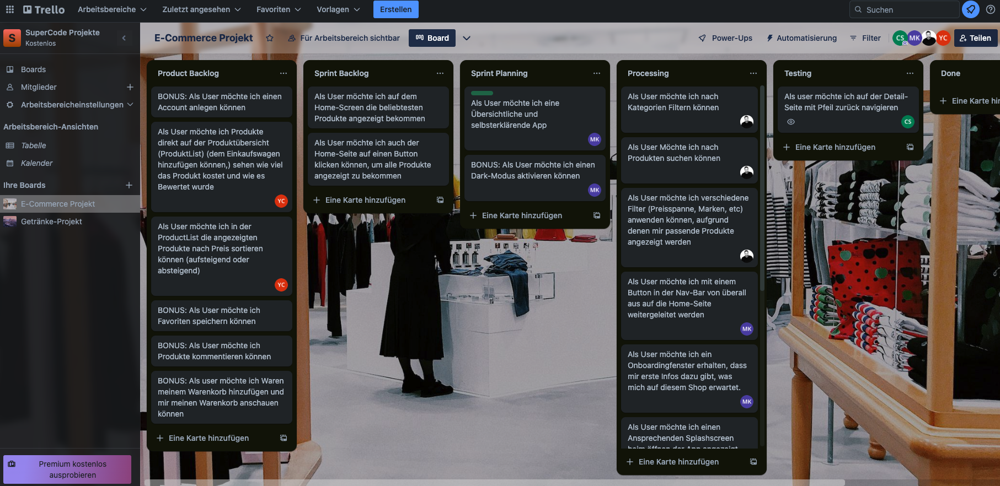
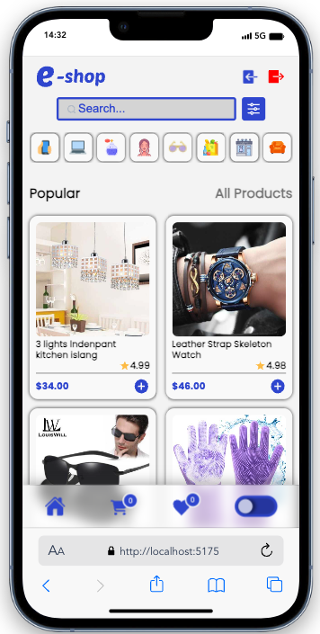
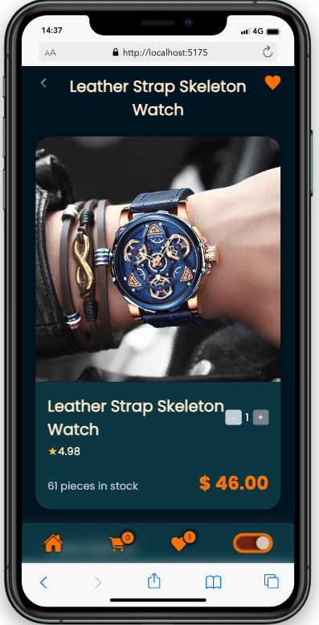
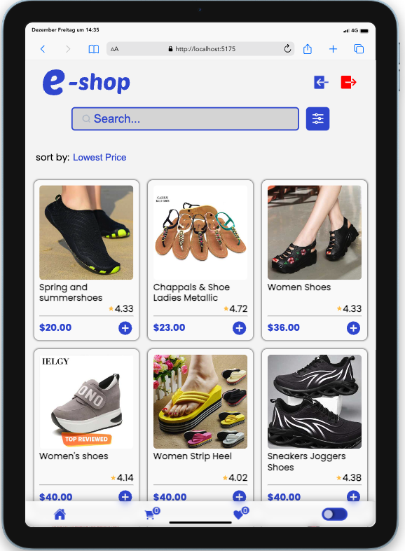
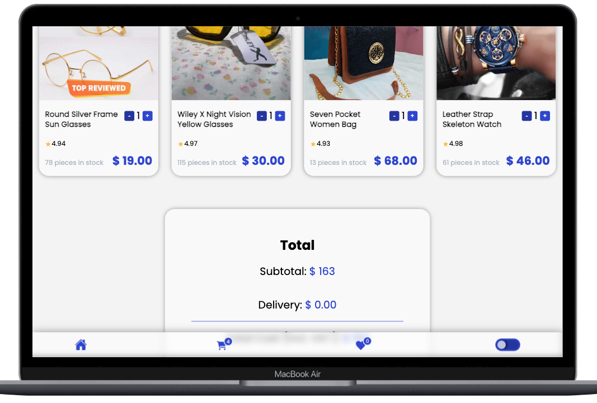

# E-Shop / Front-End Final Project 🛍️

- This project was created as part of a Full-Stack Webdeveloper bootcamp from supercode.
- It is the final frontend project that we worked on in a group of four
- We had five days to plan and implement the project. On the fifth day, the project was presented to the entire course

- The learning objective of the project:
- apply everything we have learned about the front end in the last three months
- become more experienced with the git workflow in a group

## How does the E-Shop work? ⚙️

- the website imitates an online shop with various features:

1. intuitive navigation
2. Search-Bar
3. various options for filtering:
   - categories
   - price range
   - brands etc
4. possibility to sort by price
5. dynamic detailpage for each product
6. possibility to mark products as favorites and add them to a wish list
7. add products to the shopping cart
8. display of the total price in the shopping cart
9. Dark-Light-Mode

- to see all features live just klick on the demo link below

## Demo Link

https://eshop-frontend-abschlussprojekt.netlify.app

## Some Screenshots of the Planning 📸

## E-Shop Screenshots 📸

## Copatible Screensizes 📱🖥️

- optimized for all Screensizes

## Tech Stack 💻

- react
- VS Code
- HTML
- SCSS
- vite
- GitHub
- netlify
- JavaScript
- GIT
- RESTful API (DummyJSOM)
- Figma
- Trello
- Miro

## Authors 🤵‍♀️

- [@cecilestaller](https://github.com/cecilestaller)
- [@samuelaliyari](https://github.com/samuelaliyari)
- [@KarakayaMetin8787](https://github.com/KarakayaMetin8787)
- [@canyus70](https://github.com/canyus70)

## API-Links

https://dummyjson.com/
